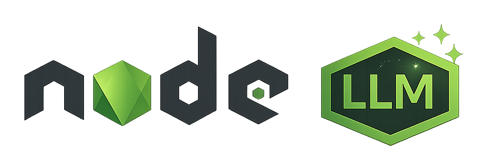

<p align="left">
  
</p>

# @node-llm/core
**One unified interface for OpenAI, Anthropic, Gemini, DeepSeek, and local models.**

**node-llm** abstracts away the chaos of vendor-specific SDKs. It gives you a clean, streaming-first API with built-in support for Vision, Tools, and Structured Outputs.

<br/>

<p align="left">
  
  
  &nbsp;&nbsp;&nbsp;&nbsp;
  
  &nbsp;&nbsp;&nbsp;&nbsp;
  
  
  &nbsp;&nbsp;&nbsp;&nbsp;
  
  
</p>

<br/>

[](https://www.npmjs.com/package/@node-llm/core)
[](https://opensource.org/licenses/MIT)
[](https://www.typescriptlang.org/)
---

## ⚡ Quick Example

```ts
import { LLM } from "@node-llm/core";

// 1. Configure once
LLM.configure({ provider: "openai" });

// 2. Chat with streaming
const chat = LLM.chat("gpt-4o");
for await (const chunk of chat.stream("Explain Node.js")) {
  process.stdout.write(chunk.content);
}
```

---

## 🔮 Capabilities

### 💬 Unified Chat
Stop rewriting code for every provider. `node-llm` normalizes inputs and outputs.

```ts
const chat = LLM.chat(); // Defaults to GPT-4o
await chat.ask("Hello world");
```

### 👁️ Smart Vision & Files
Pass images, PDFs, or audio files directly. We handle the base64 encoding and MIME types.

```ts
await chat.ask("Analyze this interface", { 
  files: ["./screenshot.png", "./specs.pdf"] 
});
```

### 🛠️ Auto-Executing Tools
Define tools once, and the library manages the execution loop for you.

```ts
const tools = [{
  type: 'function',
  function: { name: 'get_weather', ... },
  handler: async ({ loc }) => `Sunny in ${loc}`
}];

await chat.withTools(tools).ask("Weather in Tokyo?");
```

### ✨ Structured Output
Get type-safe JSON back using **Zod** schemas.

```ts
import { z } from "zod";

const Product = z.object({ name: z.string(), price: z.number() });
const res = await chat.withSchema(Product).ask("Generate a gadget");

console.log(res.parsed.name); // Type-safe access
```

### 🎨 Image Generation
```ts
await LLM.paint("A cyberpunk city in rain");
```

### 🎤 Audio Transcription
```ts
await LLM.transcribe("meeting-recording.wav");
```

---

## � Supported Providers

| Provider | Supported Features |
| :--- | :--- |
|   | Chat, Streaming, Tools, Vision, Audio, Images, Transcription |
|   | Chat, Streaming, Tools, Vision, Audio, Video, Embeddings |
|  | Chat, Streaming, Tools, Vision, PDF Support, Structured Output |
|   | Chat (V3), Reasoning (R1), Tools, Streaming, Structured Output |

---

## �🚀 Why use this over official SDKs?

| Feature | node-llm | Official SDKs |
| :--- | :--- | :--- |
| **API Style** | Consistent across all providers | Different for everyone |
| **Streaming** | Standard `AsyncIterator` | Callbacks/Events/Streams mixed |
| **Tools** | Automatic Execution Loop | Manual parsing & recursion |
| **Files** | Path string or URL | Base64 buffers / distinct types |
| **Retries** | Built-in & Configurable | Varies by SDK |

---

## 📚 Documentation & Installation

```bash
npm install @node-llm/core
```

**[View Full Documentation ↗](https://node-llm.eshaiju.com/)**

---

## 🫶 Credits

Heavily inspired by the elegant design of [RubyLLM](https://rubyllm.com/).

---

## 📄 License

MIT © [node-llm contributors]
