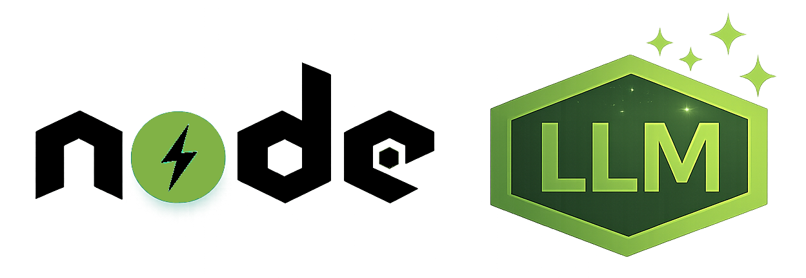

<p align="left">
  
</p>

**A simple way to use Large Language Models in Node.js.**

**Standardize your AI integration.**

If you are coming from **Ruby on Rails**, NodeLLM will feel familiar. It provides the structured approach to history and provider switching that you'd expect from a mature framework, avoiding the mess of handling raw SDKs manually.

Integrating multiple LLM providers often means juggling different SDKs, API styles, and update cycles. NodeLLM gives you a single, unified API that stays consistent even when providers change.

<div class="provider-icons">
  <div class="provider-logo">
    
    
  </div>
  <div class="provider-logo">
    
  </div>
  <div class="provider-logo">
    
    
  </div>
  <div class="provider-logo">
    
    
  </div>
  <div class="provider-logo">
    
    
  </div>
  <div class="provider-logo">
    
    
  </div>
  <div class="provider-logo">
    
    
  </div>
</div>

<br/>

[Get Started](/getting-started/overview){: .btn .btn-primary .fs-5 .mb-4 .mb-md-0 .mr-2 } [Read on Blog](https://eshaiju.com){: .btn .fs-5 .mb-4 .mb-md-0 .mr-2 } [View on GitHub](https://github.com/node-llm/node-llm){: .btn .fs-5 .mb-4 .mb-md-0 }

<p class="text-small text-grey-dk-000 mt-4">
  Distributed via <a href="https://www.npmjs.com/org/node-llm">npm</a>
</p>

---

## 🛑 What NodeLLM is NOT

NodeLLM represents a clear architectural boundary between your system and LLM vendors.

NodeLLM is **NOT**:

- A wrapper around a single provider SDK (like `openai` or `@google/generative-ai`)
- A prompt-engineering framework
- An agent playground or experimental toy

---

## 🏗️ Why NodeLLM?

Direct integrations often become tightly coupled to specific providers, making it difficult to adapt as models evolve. **LLMs should be treated as infrastructure**, and NodeLLM helps you build a stable foundation that persists regardless of which model is currently "state of the art."

NodeLLM helps solve **architectural problems**, not just provide API access. It serves as the core integration layer for LLMs in the Node.js ecosystem.

### Strategic Principles

- **Provider Isolation**: Decouple your services from vendor SDKs.
- **Production-Ready**: Native support for streaming, retries, and unified error handling.
- **Predictable API**: Consistent behavior for Tools, Vision, and Structured Outputs across all models.

---

## ⚡ The Architectural Path

```ts
import { NodeLLM } from "@node-llm/core";

// 1. Zero-Config (Uses NODELLM_PROVIDER and API keys from environment)
const chat = NodeLLM.chat("gpt-4o");

// 2. Chat (High-level request/response)
const response = await chat.ask("Explain event-driven architecture");
console.log(response.content);

// 3. Streaming (Standard AsyncIterator)
for await (const chunk of chat.stream("Explain event-driven architecture")) {
  process.stdout.write(chunk.content);
}
```

---

## 🔧 Strategic Configuration

NodeLLM provides a flexible configuration system designed for enterprise usage:

```ts
// Recommended for multi-provider pipelines
// Use createLLM() instead;

// Switch providers at the framework level
const llm = createLLM({ provider: "anthropic" });

// Support for Custom Endpoints (e.g., Azure or LocalAI)
const llm = createLLM({
  openaiApiKey: process.env.AZURE_KEY,
  openaiApiBase: "https://your-resource.openai.azure.com/openai/deployments/..."
});
```

---

## 🔮 Capabilities

### 💬 Unified Chat

Stop rewriting code for every provider. `NodeLLM` normalizes inputs and outputs into a single, predictable mental model.

```ts
import { NodeLLM } from "@node-llm/core";

// Uses NODELLM_PROVIDER from environment (defaults to GPT-4o)
const chat = NodeLLM.chat();
await chat.ask("Hello world");
```

### 👁️ Smart Vision & Files

Pass images, PDFs, or audio files directly. We handle the heavy lifting: fetching remote URLs, base64 encoding, and MIME type mapping.

```ts
await chat.ask("Analyze this interface", {
  files: ["./screenshot.png", "https://example.com/spec.pdf"]
});
```

### 🛠️ Auto-Executing Tools

Define tools once using our clean **Class-Based DSL**; NodeLLM manages the recursive execution loop for you.

```ts
import { Tool, z } from "@node-llm/core";

class WeatherTool extends Tool {
  name = "get_weather";
  description = "Get current weather";
  schema = z.object({ loc: z.string() });

  async handler({ loc }) {
    return `Sunny in ${loc}`;
  }
}

await chat.withTool(WeatherTool).ask("Weather in Tokyo?");
```

### ✨ Structured Output

Get type-safe, validated JSON back using **Zod** schemas.

```ts
import { z } from "@node-llm/core";
const Product = z.object({ name: z.string(), price: z.number() });

const res = await chat.withSchema(Product).ask("Generate a gadget");
console.log(res.parsed.name); // Full type-safety
```

### 🛡️ [Security & Compliance](/advanced/security)

Implement custom security, PII detection, and compliance logic using pluggable asynchronous hooks (`beforeRequest` and `afterResponse`).

### 🧱 [Smart Context Isolation](/advanced/security)

Stop worrying about prompt injection or instruction drift. NodeLLM automatically separates system instructions from the conversation history, providing a higher level of protection and strictness while automatically mapping roles like OpenAI's `developer` role.

### 🎨 Image Generation

```ts
await NodeLLM.paint("A cyberpunk city in rain");
```

### 🎤 Audio Transcription

```ts
await NodeLLM.transcribe("meeting-recording.wav");
```

### 💾 [Persistence Layer](/orm/prisma)

Automatically track chat history, tool executions, and API metrics with **@node-llm/orm**. Now with full support for **Extended Thinking** persistence.

```ts
import { createChat } from "@node-llm/orm/prisma";

// Chat state is automatically saved to your database (Postgres/MySQL/SQLite)
const chat = await createChat(prisma, llm, { model: "claude-3-7-sonnet" });

await chat.withThinking({ budget: 16000 }).ask("Develop a strategy");
// -> Saves User Message
// -> Saves Assistant Response + Internal Thought Process
// -> Persists Cryptographic Signatures for Reasoning
// -> Tracks Token Usage & Cost (including Reasoning Tokens)
```

### ⚡ Scoped Parallelism

Run multiple providers in parallel safely without global configuration side effects using isolated contexts. You can also override credentials (API keys) for specific instances.

```ts
const [gpt, claude] = await Promise.all([
  // Each call branch off into its own isolated context
  NodeLLM.withProvider("openai").chat("gpt-4o").ask(prompt),
  NodeLLM.withProvider("anthropic", { anthropicApiKey: "..." })
    .chat("claude-3-5-sonnet")
    .ask(prompt)
]);
```

### 🧠 [Extended Thinking](/core-features/reasoning)

Direct access to the thought process of modern reasoning models like **Claude 3.7**, **DeepSeek R1**, or **OpenAI o1/o3** using a unified interface.

```ts
const res = await chat
  .withThinking({ budget: 16000 })
  .ask("Solve this logical puzzle");

console.log(res.thinking.text); // Full chain-of-thought
console.log(res.thinking.signature); // Verification signature
```

---

## 🚀 Why Use This Over Official SDKs?

| Feature            | NodeLLM                       | Official SDKs               | Architectural Impact      |
| :----------------- | :---------------------------- | :-------------------------- | :------------------------ |
| **Provider Logic** | Transparently Handled         | Exposed to your code        | **Low Coupling**          |
| **Streaming**      | Standard `AsyncIterator`      | Vendor-specific Events      | **Predictable Data Flow** |
| **Tool Loops**     | Automated Recursion           | Manual implementation       | **Reduced Boilerplate**   |
| **Files/Vision**   | Intelligent Path/URL handling | Base64/Buffer management    | **Cleaner Service Layer** |
| **Configuration**  | Centralized & Global          | Per-instance initialization | **Easier Lifecycle Mgmt** |

---

## 📋 Supported Providers

| Provider                                                                                                                             | Supported Features                                                                                    |
| :----------------------------------------------------------------------------------------------------------------------------------- | :---------------------------------------------------------------------------------------------------- |
|  **OpenAI**            | Chat, Streaming, Tools, Vision, Audio, Images, Transcription, **Reasoning**, **Smart Developer Role** |
|  **Gemini**      | Chat, Streaming, Tools, Vision, Audio, Video, Embeddings                                              |
|  **Anthropic** | Chat, Streaming, Tools, Vision, PDF, Structured Output, **Extended Thinking (Claude 3.7)**            |
|  **DeepSeek**  | Chat (V3), **Extended Thinking (R1)**, Tools, Streaming                                              |
|  **Bedrock**    | Chat, Streaming, Tools, Image Gen (Titan/SD), Embeddings, **Prompt Caching**                         |
|  **OpenRouter**    | **Aggregator**, Chat, Streaming, Tools, Vision, Embeddings, **Reasoning**                             |
|  **Ollama**            | **Local Inference**, Chat, Streaming, Tools, Vision, Embeddings                                       |

---

## 🍿 Try The Live Demo

Want to see NodeLLM in action? We have a full-stack, multi-provider example application ready for you.

```bash
git clone https://github.com/node-llm/node-llm.git
cd node-llm
npm install
npm run demo
```

---

## 🤝 Contributing

We welcome contributions! Please see our [Contributing Guide](https://github.com/node-llm/node-llm/blob/main/CONTRIBUTING.md) for more details on how to get started.

---

## 🫶 Credits

Heavily inspired by the elegant design of [RubyLLM](https://rubyllm.com/).

---

**Upgrading to v1.6.0?** Read the [Migration Guide](/getting_started/migration-v1-6.html) to understand the new strict provider requirements and typed error hierarchy.
