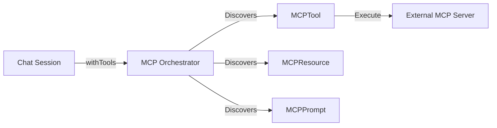

# 🔌 Model Context Protocol (MCP)

NodeLLM acts as an **MCP Host**, allowing you to bridge AI agents to external tools, resources, and prompts provided by any MCP-compliant server.

This avoids writing custom integrations for every API (GitHub, Slack, Postgres) by using a standardized protocol to discover and execute capabilities.

---

## 🏗️ The Bridge Pattern

NodeLLM connects to an external server (via Stdio or HTTP/SSE) and proxies its capabilities as native NodeLLM objects.



### Features:
- **Protocol Discovery**: Connect to any MCP server to discover tools, resources, and prompts.
- **Dynamic Context**: Inject codebase information or database schemas as **Resources**.
- **Observability**: Real-time logging and notification events for server processes.

---

## ⚡ Capability Discovery

### 🛠️ Tool Discovery
Connect to any MCP server and expose its tools as native NodeLLM tool objects.

```typescript
import { MCP } from "@node-llm/mcp";

// 1. Connect via Stdio
const mcp = await MCP.connect({
  command: "npx",
  args: ["-y", "@modelcontextprotocol/server-github"]
});

// 2. Discover tools and start chat
const tools = await mcp.discoverTools();
const chat = llm.chat().withTools(tools);

await chat.ask("List my top 5 GitHub stars");
```

### 📖 Resource Discovery
Resources provide context like file contents, database schemas, or API docs.

```typescript
// Discover static resources
const resources = await mcp.discoverResources();
const dbSchema = resources.find(r => r.name === "database_schema");

if (dbSchema) {
  const content = await dbSchema.read();
  console.log(content.contents[0].text);
}
```

### 📝 Prompt Discovery
Server-defined prompt templates that simplify complex instruction sets.

```typescript
// Discover prompt templates
const prompts = await mcp.discoverPrompts();
const codeReview = prompts.find(p => p.name === "Code Review");

if (codeReview) {
  // Get prompt messages with required parameters
  const reviewContent = await codeReview.get({ 
    code: "function main() { ... }" 
  });
  
  // Use messages in a chat session
  const chat = llm.chat().addMessages(reviewContent.messages);
}
```

---

## ⚙️ Infrastructure Details

### 🩺 Monitoring
The `MCP` class extends `EventEmitter` to provide visibility into the server process.

```typescript
const mcp = await MCP.connect({ command: "...", args: ["..."] });

// Server stderr logs
mcp.on("log", (msg) => {
  console.log(`[SERVER LOG] ${msg}`);
});

// Protocol notifications
mcp.on("notification", (notif) => {
  console.log(`Protocol event: ${notif.method}`);
});
```

### 🛡️ Error Handling
NodeLLM handles partial protocol implementations. If a server does not support a specific capability (returning `-32601 Method Not Found`), the discovery methods return an empty list `[]` instead of throwing an error.

### 🌐 HTTP Transport
Supports remote servers over HTTP using the `Streamable HTTP` transport. 

```typescript
const mcp = await MCP.connectSSE({
  url: "https://mcp-server.example.com/sse"
});
```

---

## 🔍 Discovery Manifest

Discover all server capabilities in a single call.

```typescript
const { tools, resources, resourceTemplates, prompts } = await mcp.discover({ prefix: "fs_" });
```

### 🗂️ Resource Templates
Parameterized URI patterns for dynamic data access.

```typescript
const template = resourceTemplates.find(t => t.name === "Project Logs");

// Resolve parameters into a concrete resource
const resource = await template.resolve({ owner: "eshaiju", repo: "node-llm" });
const content = await resource.read();
```

---

## 📂 Examples

Reference scripts:

- **[Monitor and Templates](https://github.com/node-llm/node-llm/blob/main/examples/scripts/mcp/core-explorer/monitor-and-templates.ts)**: Demonstrates event monitoring and resource templates.
- **[Filesystem Auditor](https://github.com/node-llm/node-llm/blob/main/examples/scripts/mcp/filesystem/inspect-mcp.ts)**: Uses the Filesystem server to analyze local source code.
- **[Multi-Tool Agent](https://github.com/node-llm/node-llm/blob/main/examples/scripts/mcp/agent-flow/multi-tool-agent.ts)**: Orchestrates multiple servers.

---

## 📋 Project Status

- [x] Phase 1: Tool Execution & Dynamic Proxying
- [x] Phase 2: Resource/Prompt Discovery & Monitoring
- [ ] Phase 3: Sampling & Context Hooks (Coming Soon)
