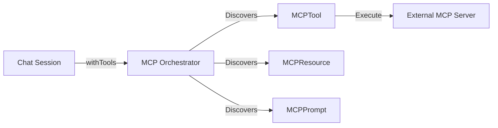

# 🔌 Model Context Protocol (MCP)

NodeLLM acts as an **MCP Host**, allowing you to bridge AI agents to external tools, resources, and prompts provided by any MCP-compliant server.

This avoids writing custom integrations for every API (GitHub, Slack, Postgres) by using a standardized protocol to discover and execute capabilities.

---

## 🏗️ The Bridge Pattern

NodeLLM connects to an external server (via Stdio or HTTP/SSE) and proxies its capabilities as native NodeLLM objects.



### Features:
- **Protocol Discovery**: Connect to any MCP server to discover tools, resources, and prompts.
- **Dynamic Context**: Inject codebase information or database schemas as **Resources**.
- **Observability**: Real-time logging and progress notifications using a chainable DSL.
- **Multi-Server Orchestration**: Connect to multiple servers concurrently with a single config.

---

## ⚡ Capability Discovery

### 🛠️ Tool Discovery
Connect to any MCP server and expose its tools as native NodeLLM tool objects.

```typescript
import { MCP } from "@node-llm/mcp";

// Connect with chainable monitoring
const mcp = (await MCP.connect({
  command: "npx",
  args: ["-y", "@modelcontextprotocol/server-github"]
})).onLog(e => console.log(e.message));

const tools = await mcp.discoverTools();
const chat = llm.chat().withTools(tools);

await chat.ask("List my top 5 GitHub stars");
```

### 📖 Resource Discovery
Resources provide context like file contents, database schemas, or API docs.

```typescript
// Discover static resources
const resources = await mcp.discoverResources();
const dbSchema = resources.find(r => r.name === "database_schema");

if (dbSchema) {
  const text = await dbSchema.readText(); // Concatenated text content
  console.log(text);
}
```

### 📝 Prompt Discovery
Server-defined prompt templates that simplify complex instruction sets.

```typescript
// Discover prompt templates
const prompts = await mcp.discoverPrompts();
const codeReview = prompts.find(p => p.name === "Code Review");

if (codeReview) {
  // Get prompt messages with required parameters
  const reviewContent = await codeReview.get({ 
    code: "function main() { ... }" 
  });
  
  // Use messages in a chat session
  const chat = llm.chat().addMessages(reviewContent.messages);
}
```

---

## ⚙️ Infrastructure Details

### DSL (Monitoring)
The `MCP` class provides a clean, chainable API for observing server activity.

```typescript
const mcp = (await MCP.connect({ command: "...", args: ["..."] }))
  .onLog(({ level, message }) => {
    console.log(`[${level.toUpperCase()}] ${message}`);
  })
  .onProgress(({ progress, total }) => {
    console.log(`Operation Progress: ${progress}/${total}`);
  })
  .onError(err => console.error("Protocol Error:", err));
```

### 🛰️ Multi-Server Orchestration
Connect to multiple MCP servers simultaneously from a central config.

```typescript
const mcps = await MCP.connectAll({
  fs: { command: "npx", args: ["-y", "@modelcontextprotocol/server-filesystem"] },
  brave: { command: "npx", args: ["-y", "@modelcontextprotocol/server-brave-search"] }
});

const allTools = [
  ...await mcps.fs.discoverTools(),
  ...await mcps.brave.discoverTools()
];
```

---

## 🛡️ Error Handling
NodeLLM handles partial protocol implementations. If a server does not support a specific capability (returning `-32601 Method Not Found`), the discovery methods return an empty list `[]` instead of throwing an error.

### 🌐 HTTP Transport
Supports remote servers over HTTP using the `Streamable HTTP` transport. 

```typescript
const mcp = await MCP.connectSSE({
  url: "https://mcp-server.example.com/sse"
});
```

---

## 🔍 Discovery Manifest

Discover all server capabilities in a single call.

```typescript
const { tools, resources, resourceTemplates, prompts } = await mcp.discover({ prefix: "fs_" });
```

### 🗂️ Resource Templates
Parameterized URI patterns for dynamic data access.

```typescript
const template = resourceTemplates.find(t => t.name === "Project Logs");

// Resolve parameters into a concrete resource
const resource = await template.resolve({ owner: "eshaiju", repo: "node-llm" });
const content = await resource.read();
```

---

## 📗 API Reference

### `MCP` Class

#### `static async connect(config: StdioConfig): Promise<MCP>`
Initializes a Stdio-based connection (local process).

#### `static async connectSSE(config: SSEConfig): Promise<MCP>`
Initializes an HTTP-based connection via Server-Sent Events.

#### `static async connectAll(config: MCPConfig): Promise<Record<string, MCP>>`
Batch initialization for multiple servers.

#### `async discover(options?: DiscoveryOptions): Promise<Manifest>`
The master discovery method. Returns tools, resources, and prompts in parallel.

#### `onLog(handler): this`
Registers a listener for server logs. Returns `{ level: string, message: string }`.

#### `onProgress(handler): this`
Registers a listener for progress notifications. Returns `{ progress: number, total: number, message?: string }`.

### `MCPResource` Class

#### `async readText(): Promise<string>`
Helper to fetch and concatenate all text parts of a resource.

---

## 📂 Examples

Reference scripts:

- **[Monitor and Templates](https://github.com/node-llm/node-llm/blob/main/examples/scripts/mcp/core-explorer/monitor-and-templates.ts)**: Demonstrates event monitoring and resource templates.
- **[Filesystem Auditor](https://github.com/node-llm/node-llm/blob/main/examples/scripts/mcp/filesystem/inspect-mcp.ts)**: Uses the Filesystem server to analyze local source code.
- **[Multi-Tool Agent](https://github.com/node-llm/node-llm/blob/main/examples/scripts/mcp/agent-flow/multi-tool-agent.ts)**: Orchestrates multiple servers.

---

## 📋 Project Status

- [x] Phase 1: Tool Execution & Dynamic Proxying
- [x] Phase 2: Resource/Prompt Discovery & Monitoring
- [ ] Phase 3: Sampling & Context Hooks (Coming Soon)
