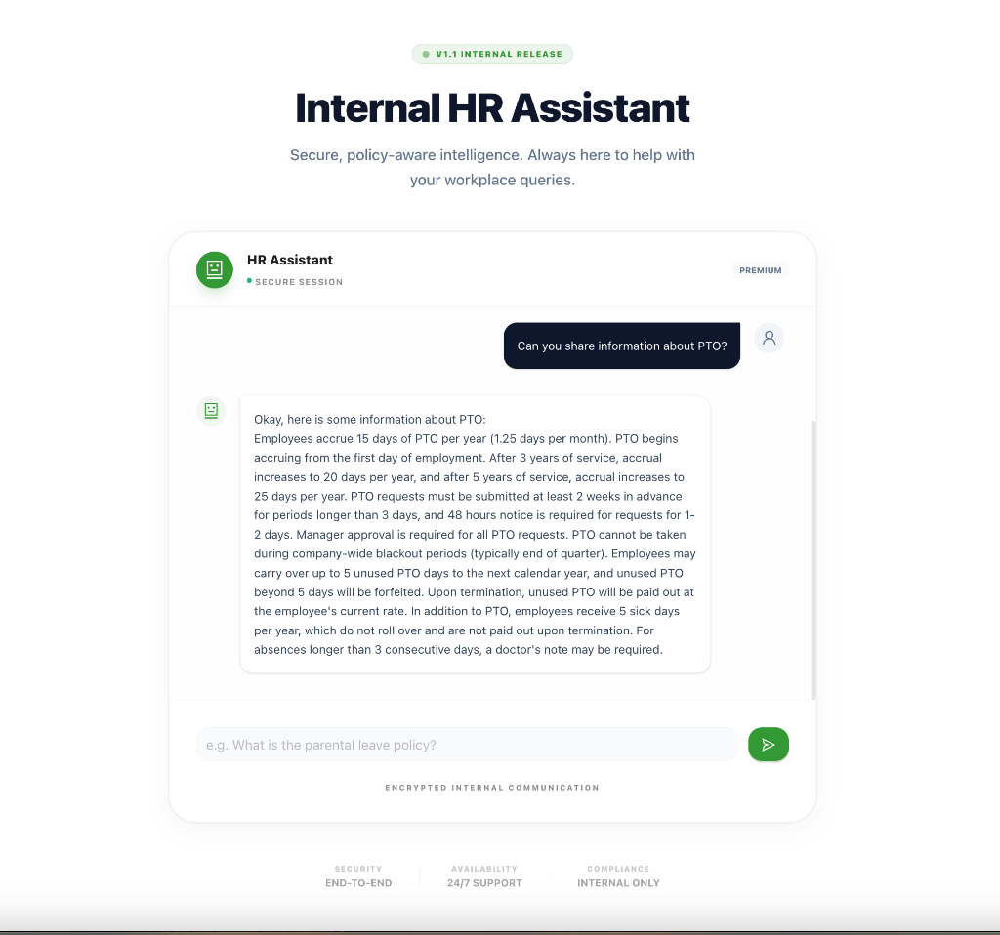

# NodeLLM Examples

This directory contains examples demonstrating how to integrate LLMs as an architectural surface using `NodeLLM`.

## 🎯 Flagship Examples (Full Applications)

### 1. HR Chatbot with RAG & Streaming

A complete, production-ready Next.js application demonstrating the full NodeLLM stack: RAG, streaming, persistence with `@node-llm/orm`, and real-time chat.



**Features:** Streaming responses, vector search, chat persistence, tool calling, JSON metadata, custom fields

**[View Example →](./applications/hr-chatbot-rag/)**

---

### 2. Brand Perception Checker

A full-stack application demonstrating multi-provider orchestration, tool calling, and structured outputs.


**[View Example →](./applications/brand-perception-checker/)**

---

## Available Provider Scripts

These standalone scripts demonstrate specific features of each provider.

- **DeepSeek**: `examples/scripts/deepseek/`
- **OpenAI**: `examples/scripts/openai/`
- **Anthropic**: `examples/scripts/anthropic/`
- **Gemini**: `examples/scripts/gemini/`
- **OpenRouter**: `examples/scripts/openrouter/`
- **Ollama**: `examples/scripts/ollama/`
- **Core (Advanced)**: `examples/scripts/core/`

## Prerequisites

1.  **Environment Variables**: Ensure you have a `.env` file in the root of your project with the API keys for the providers you want to use:

    ```env
    OPENAI_API_KEY=your_openai_api_key
    DEEPSEEK_API_KEY=your_deepseek_api_key
    ANTHROPIC_API_KEY=your_anthropic_api_key
    GEMINI_API_KEY=your_gemini_api_key
    OPENROUTER_API_KEY=your_openrouter_api_key
    NODELLM_PROVIDER=openai # Required for NodeLLM Direct pattern
    ```

2.  **Build**: Before running examples, make sure the core package is built:
    ```bash
    npm run build --workspace=packages/core
    ```

## Configuration

Examples use one of three patterns:

1. **NodeLLM Direct** (simplest - uses environment variables):

```javascript
import { NodeLLM } from "@node-llm/core";
const chat = NodeLLM.chat("gpt-4");
```

2. **createLLM()** (recommended - explicit configuration):

```javascript
import { createLLM } from "@node-llm/core";
const llm = createLLM({
  provider: "openai",
  openaiApiKey: process.env.OPENAI_API_KEY
});
const chat = llm.chat("gpt-4");
```

3. **withProvider()** (advanced - runtime switching):

```javascript
import { NodeLLM } from "@node-llm/core";
const llm = NodeLLM.withProvider("openai", {
  openaiApiKey: process.env.OPENAI_API_KEY
});
```

See [Configuration Guide](../docs/getting_started/configuration.md) for full details.

---

## OpenAI Examples (Primary)

OpenAI is the most feature-complete provider in `NodeLLM`.

### 1. Running All OpenAI Examples

To run the full suite of OpenAI examples:

```bash
./examples/scripts/openai/run.sh
```

### 2. Security & Resource Limits (NEW)

- **Complete Security Config**: `node examples/scripts/openai/security/configuration.mjs`
- **Request Timeouts**: `node examples/scripts/openai/security/request-timeout.mjs`
- **Content Policy Hooks**: `node examples/scripts/openai/security/content-policy-hooks.mjs`
- **Tool Verification Policy**: `node examples/scripts/openai/security/tool-policies.mjs`

### 3. Running Individual OpenAI Examples

- **Basic Chat**: `node examples/scripts/openai/chat/basic.mjs`
- **Streaming**: `node examples/scripts/openai/chat/streaming.mjs`
- **Tools (Class-Based)**: `node examples/scripts/openai/chat/tools.mjs`
- **Tools (Raw JSON)**: `node examples/scripts/openai/chat/raw-json.mjs`
- **Reasoning (o1/o3)**: `node examples/scripts/openai/chat/reasoning.mjs`
- **Vision**: `node examples/scripts/openai/multimodal/vision.mjs`
- **Speech (TTS)**: `node examples/scripts/openai/multimodal/audio.mjs`
- **Image Generation**: `node examples/scripts/openai/images/generate.mjs`

### 4. Advanced Core Patterns

- **Global Configuration**: `node examples/scripts/openai/core/configuration.mjs`
- **Support Agent Pattern**: `node examples/scripts/openai/core/support-agent.mjs`
- **Parallel Provider Scoring**: `node examples/scripts/openai/core/parallel-scoring.mjs`
- **Custom API Endpoints**: `node examples/scripts/openai/core/custom-endpoints.mjs`
- **Custom Provider Implementation**: `node examples/scripts/core/custom-provider.mjs`
- **Lazy Agent DSL (Dynamic Context)**: `node examples/scripts/core/agents/lazy.mjs`

---

## DeepSeek Examples

You can run DeepSeek examples individually using `node` or run the entire suite using the provided shell script.

### 1. Running All DeepSeek Examples

To run all available DeepSeek examples to verify functionality:

```bash
./examples/scripts/deepseek/run.sh
```

### 2. Running Individual DeepSeek Examples

- **Chat**: `node examples/scripts/deepseek/chat/basic.mjs`
- **Streaming**: `node examples/scripts/deepseek/chat/streaming.mjs`
- **Structured Output**: `node examples/scripts/deepseek/chat/structured.mjs`
- **Tools (Class-Based)**: `node examples/scripts/deepseek/chat/tools.mjs`
- **Tools (Raw JSON)**: `node examples/scripts/deepseek/chat/raw-json.mjs`
- **Reasoning (R1)**: `node examples/scripts/deepseek/chat/reasoning.mjs`
- **Model Info**: `node examples/scripts/deepseek/discovery/models.mjs`

---

## Gemini Examples

### 1. Running All Gemini Examples

```bash
./examples/scripts/gemini/run.sh
```

### 2. Running Individual Gemini Examples

- **Basic Chat**: `node examples/scripts/gemini/chat/basic.mjs`
- **Tools (Class-Based)**: `node examples/scripts/gemini/chat/tools.mjs`
- **Tools (Raw JSON)**: `node examples/scripts/gemini/chat/raw-json.mjs`
- **Vision**: `node examples/scripts/gemini/multimodal/vision.mjs`
- **Embeddings**: `node examples/scripts/gemini/embeddings/create.mjs`

---

## Anthropic Examples

### 1. Running All Anthropic Examples

```bash
./examples/scripts/anthropic/run.sh
```

### 2. Running Individual Anthropic Examples

- **Basic Chat**: `node examples/scripts/anthropic/chat/basic.mjs`
- **Tools (Class-Based)**: `node examples/scripts/anthropic/chat/tools.mjs`
- **Tools (Raw JSON)**: `node examples/scripts/anthropic/chat/raw-json.mjs`
- **Streaming Tools**: `node examples/scripts/anthropic/chat/streaming-tools.mjs`

### 3. Unsupported Features (Error Handling)

These scripts demonstrate that `NodeLLM` correctly raises errors for features not supported by DeepSeek (Multimodal, Embeddings, Image Generation).

- `node examples/scripts/deepseek/multimodal/vision.mjs`
- `node examples/scripts/deepseek/embeddings/basic.mjs`
- `node examples/scripts/deepseek/images/generate.mjs`
- `node examples/scripts/deepseek/safety/moderation.mjs`

---

## OpenRouter Examples

### 1. Running All OpenRouter Examples

```bash
./examples/scripts/openrouter/run.sh
```

### 2. Running Individual OpenRouter Examples

- **Basic Chat**: `node examples/scripts/openrouter/chat/basic.mjs`
- **Streaming**: `node examples/scripts/openrouter/chat/streaming.mjs`
- **Tools**: `node examples/scripts/openrouter/chat/tools.mjs`
- **Reasoning**: `node examples/scripts/openrouter/chat/reasoning.mjs`
- **Embeddings**: `node examples/scripts/openrouter/embeddings/create.mjs`


## Troubleshooting

- **API Key Error**: Ensure the relevant API key (e.g., `DEEPSEEK_API_KEY` or `OPENAI_API_KEY`) is set in your `.env` file.
- **Build Errors**: Run `npm run build --workspace=packages/core` if you recently changed core code.
- **Rate Limits**: Providers have rate limits. If scripts fail with 429 errors, wait a moment and try again. The runner scripts include delays to mitigate this.
