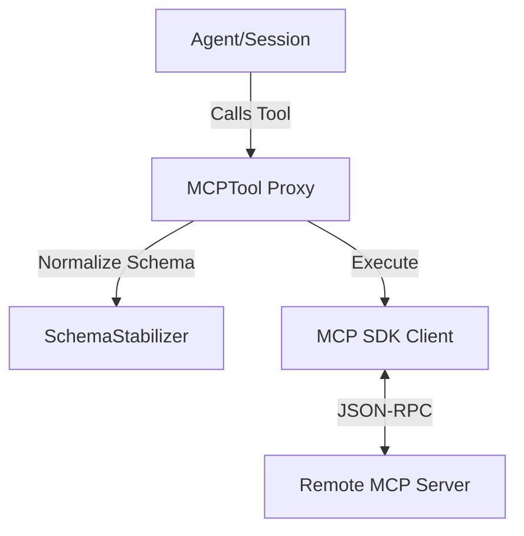

# @node-llm/mcp Architecture

This document describes the design and components of the Model Context Protocol (MCP) integration for NodeLLM.

## 🌉 The Bridge Pattern

`node-llm` acts as an **MCP Host**. It connects to external **MCP Servers** and surfaces their capabilities as native NodeLLM objects.



## 🧩 Core Components

### 1. SchemaStabilizer

Many MCP servers provide JSON Schemas that are syntactically valid but incompatible with strict LLM providers (like OpenAI's structured outputs).

- **Role**: Recursively normalizes schemas.
- **Key Action**: Ensures `type: "object"` always has a `properties` object.
- **Cleanup**: Removes non-standard keys like `$schema`.

### 2. MCPTool

A subclass of `node-llm`'s `Tool` that acts as a proxy.

- **Dynamic Definition**: Generates `ToolDefinition` on the fly based on MCP metadata.
- **Execution**: Wraps the MCP `callTool` request and concatenates text content results.

### 3. MCPRegistry

The primary entry point for developers.

- **Discovery**: Connects to a transport and lists all available tools.
- **Namespacing**: Optional `prefix` support to avoid tool name collisions when using multiple servers.

## 🛠 Usage Example (v1.0 Basic)

```typescript
import { MCPRegistry } from "@node-llm/mcp";
import { StdioClientTransport } from "@modelcontextprotocol/sdk/client/stdio.js";

const transport = new StdioClientTransport({
  command: "npx",
  args: ["-y", "@modelcontextprotocol/server-github"]
});

const mcp = new MCPRegistry(transport);
const tools = await mcp.discoverTools({ prefix: "github_" });

const chat = llm.chat("gpt-4").withTools(tools);
const response = await chat.ask("Create a GitHub repository");
```

## 📊 Structured Results (Phase 1)

Tool execution returns `MCPExecutionResult` with multiple content types:

```typescript
interface MCPExecutionResult {
  text?: string; // Human-readable text output
  data?: unknown; // Structured JSON data (single or array)
  resources?: any[]; // Resource references (Phase 2)
  raw: unknown; // Complete MCP response for debugging
}
```

**Benefits:**

- Preserves structured data loss (not concatenated as text)
- Separates concerns: display vs computation
- Enables AI to work with actual JSON, not string representations
- Forward-compatible with Phase 2 (resources, prompts)

**Example:**

```typescript
const result = await tool.execute({ query: "SELECT * FROM users" });
console.log(result.text); // "5 rows found"
console.log(result.data); // [{id:1, name:...}, {...}, ...]
console.log(result.raw); // Complete MCP response object
```

## 🤖 Agent Patterns

### Multi-Tool Agent (Tool Discovery)

Combine multiple MCP servers and let the agent choose which tools to use:

```typescript
const fsTools = await fsRegistry.discoverTools({ prefix: "fs_" });
const dbTools = await dbRegistry.discoverTools({ prefix: "db_" });
const allTools = [...fsTools, ...dbTools];

const chat = llm.chat("gpt-4").withTools(allTools);
const response = await chat.ask("Analyze the codebase");
```

**See:** [examples/scripts/mcp/agent-flow/multi-tool-agent.ts](../../examples/scripts/mcp/agent-flow/multi-tool-agent.ts)

### Step-by-Step Agent (Orchestration)

For structured workflows with explicit control and audit trails:

```typescript
class SimpleAgent {
  steps: AgentStep[] = [];

  async executeStep(objective: string, context: string) {
    const response = await this.chat.ask(`${objective}. Context: ${context}`);
    const toolsUsed = response.toolCalls?.map((c) => c.name) || [];
    this.steps.push({ objective, toolsUsed, result: response.text });
  }

  getSummary() {
    return JSON.stringify(this.steps, null, 2);
  }
}
```

**See:** [examples/scripts/mcp/agent-flow/step-agent.ts](../../examples/scripts/mcp/agent-flow/step-agent.ts)

## 🔄 Phase-Based API Design

The API is structured to enable future phases without breaking changes:

- **Phase 1**: Tools only (`discoverTools()`) ✅ Complete
- **Phase 1 Stubs**: Resources & Prompts (`discoverResources()`, `discoverPrompts()`)
- **Phase 2**: Full resource/prompt support
- **Phase 3**: Multi-server composition, lifecycle hooks, notifications

Each phase adds new methods while maintaining backward compatibility.
