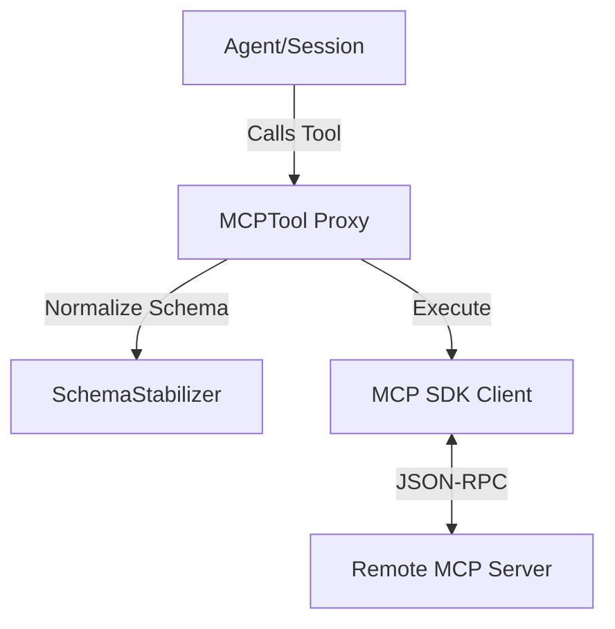

# @node-llm/mcp Architecture

This document describes the design and components of the Model Context Protocol (MCP) integration for NodeLLM.

## 🌉 The Bridge Pattern

`node-llm` acts as an **MCP Host**. It connects to external **MCP Servers** and surfaces their capabilities as native NodeLLM objects.



## 🧩 Core Components

### 1. SchemaStabilizer

Many MCP servers provide JSON Schemas that are syntactically valid but incompatible with strict LLM providers (like OpenAI's structured outputs).

- **Role**: Recursively normalizes schemas.
- **Key Action**: Ensures `type: "object"` always has a `properties` object.
- **Cleanup**: Removes non-standard keys like `$schema`.

### 2. MCPTool

A subclass of `node-llm`'s `Tool` that acts as a proxy.

- **Dynamic Definition**: Generates `ToolDefinition` on the fly based on MCP metadata.
- **Execution**: Wraps the MCP `callTool` request and concatenates text content results.

### 3. MCPRegistry

The primary entry point for developers.

- **Discovery**: Connects to a transport and lists all available tools.
- **Namespacing**: Optional `prefix` support to avoid tool name collisions when using multiple servers.

## 🛠 Usage Example (v1.0 Basic)

```typescript
import { MCPRegistry } from "@node-llm/mcp";
import { StdioClientTransport } from "@modelcontextprotocol/sdk/client/stdio.js";

const transport = new StdioClientTransport({
  command: "npx",
  args: ["-y", "@modelcontextprotocol/server-github"]
});

const mcp = new MCPRegistry(transport);
const tools = await mcp.discover({ prefix: "github_" });

const session = new AgentSession({ tools });
```
